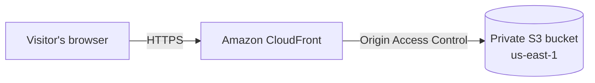

# Cloud Resume
 
My resume, built as a website and hosted on AWS. This project follows the [Cloud Resume Challenge](https://cloudresumechallenge.dev/): a static site served over HTTPS through a content delivery network, with a visitor counter backed by a serverless API and a database, and the infrastructure defined as code and deployed automatically.
 
I am building it in stages and documenting each one as I go. This README reflects where the project currently stands.
 
**Live site:** https://d19gfzqslspvcu.cloudfront.net
 
## Current status
 
| Stage | Description | Status |
|---|---|---|
| 1 | Resume written in HTML, CSS and JavaScript | Complete |
| 2 | Private S3 bucket for site files | Complete |
| 3 | CloudFront distribution with Origin Access Control and HTTPS | Complete |
| 4 | Custom domain, DNS and TLS certificate (Route 53, ACM) | Next |
| 5 | Visitor counter: DynamoDB, Lambda and API Gateway | Planned |
| 6 | Tests for the backend and an end-to-end test for the site | Planned |
| 7 | Infrastructure defined in Terraform | Planned |
| 8 | CI/CD with GitHub Actions using OIDC | Planned |
 
## Architecture
 
The architecture as it stands today:
 

 
A visitor's request goes to the nearest CloudFront edge location. CloudFront serves a cached copy of the page where it has one, and otherwise fetches the files from the S3 bucket. The bucket itself is not publicly accessible. Its bucket policy allows reads only from the CloudFront service, and only on behalf of this specific distribution.
 
Once the visitor counter is in place, the page will also call an API Gateway endpoint that invokes a Lambda function, which updates a count stored in DynamoDB.
 
## Tech stack
 
- **Frontend:** HTML, CSS and vanilla JavaScript, with no framework or build step
- **Hosting:** Amazon S3
- **Content delivery and HTTPS:** Amazon CloudFront
- **Access control:** CloudFront Origin Access Control with a scoped S3 bucket policy
Planned additions include Route 53, AWS Certificate Manager, AWS Lambda (Python), Amazon API Gateway, Amazon DynamoDB, Terraform and GitHub Actions.
 
## Repository structure
 
```
.
├── index.html    # Resume content and page structure
├── styles.css    # Layout, typography, dark mode and print styles
├── counter.js    # Visitor counter client (inactive until the API is deployed)
└── README.md
```
 
## Running locally
 
No build tools or dependencies are required. Clone the repository and open `index.html` in a browser:
 
```bash
git clone https://github.com/RisheDubs/cloud-resume.git
cd cloud-resume
open index.html        # macOS
xdg-open index.html    # Linux
```
 
The visitor counter shows a placeholder until an API endpoint is set in `counter.js`.
 
## Deployment
 
At this stage, deployment is manual:
 
1. Upload `index.html`, `styles.css` and `counter.js` to the root of the S3 bucket.
2. Create a CloudFront invalidation for `/*` so the updated files are served immediately rather than after the cache expires.
This will be replaced by a GitHub Actions workflow in a later stage.
 
## Design decisions
 
**A private bucket instead of S3 static website hosting.** Many older guides make the bucket public and use the S3 website endpoint. I kept the bucket private and placed CloudFront in front of it using Origin Access Control. This means the files can only be reached through CloudFront, which also provides HTTPS, since the S3 website endpoint does not support it.
 
**Deploying to us-east-1.** I am based in Melbourne, so a Sydney region was the obvious first choice. However, visitors never connect to the bucket directly, and CloudFront serves the site from edge locations close to them, including in Australia, so the bucket's region has little effect on page load times. The certificate CloudFront uses for a custom domain must be issued in us-east-1 regardless, so keeping everything in one region simplifies both the console setup and the Terraform configuration to come. The trade-off is added latency on the future API call from Australia, which is acceptable for a visitor counter.
 
**No frontend framework.** A resume is a single, mostly static page. Plain HTML and CSS keep it fast, easy to read and free of build tooling, which leaves the focus of the project on the cloud infrastructure.
 
## Challenges and lessons learned
 
**Caching after updates.** After uploading a revised page, CloudFront continued to serve the previous version. This is expected behaviour, since CloudFront caches content at its edge locations. Creating an invalidation resolved it, and it made clear that the eventual deployment pipeline needs an invalidation step.
 
**Confirming the bucket was actually private.** Before connecting CloudFront, I opened a file's S3 object URL directly and received an `AccessDenied` response. It was reassuring to see a security control fail in the intended way rather than assuming it was configured correctly.
 
**Understanding the bucket policy.** The policy CloudFront generated grants `s3:GetObject` to the CloudFront service principal, with a condition restricting access to this distribution's ARN. Without that condition, any CloudFront distribution could potentially request objects from the bucket. Reading through the policy line by line was more useful than simply accepting it.
 
**Default root object.** Requesting the bare domain returns an error unless CloudFront is told which file to serve at the root. Setting the default root object to `index.html` fixed this.
 
## Cost
 
The site runs within AWS free usage allowances at its current traffic. A zero-spend AWS Budget is configured to send an email alert if any charges occur.
 
## Next steps
 
The next stage is to register a custom domain, issue a TLS certificate through AWS Certificate Manager and point the domain at the CloudFront distribution. After that, I will build the visitor counter backend.
 
## Contact
 
**Rishekesh B**
[rishekeshris@gmail.com](mailto:rishekeshris@gmail.com) · [LinkedIn](https://linkedin.com/in/rishekesh-b-95641120b)
 

